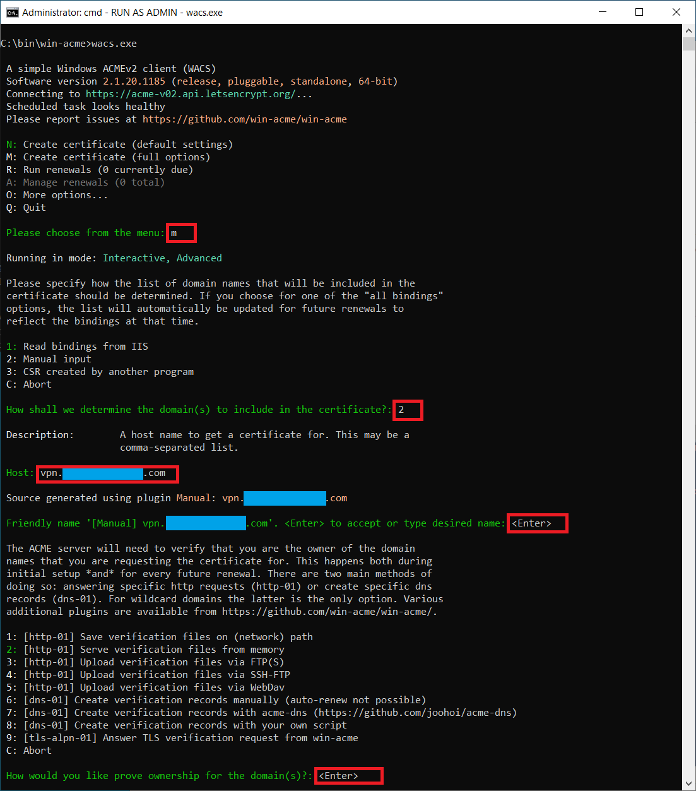
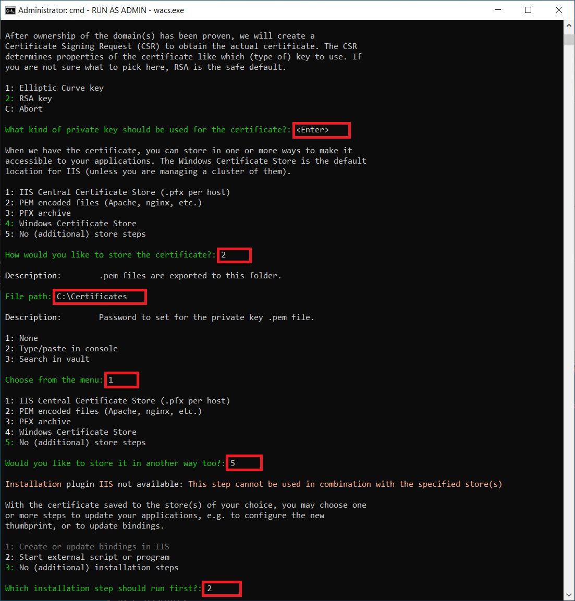
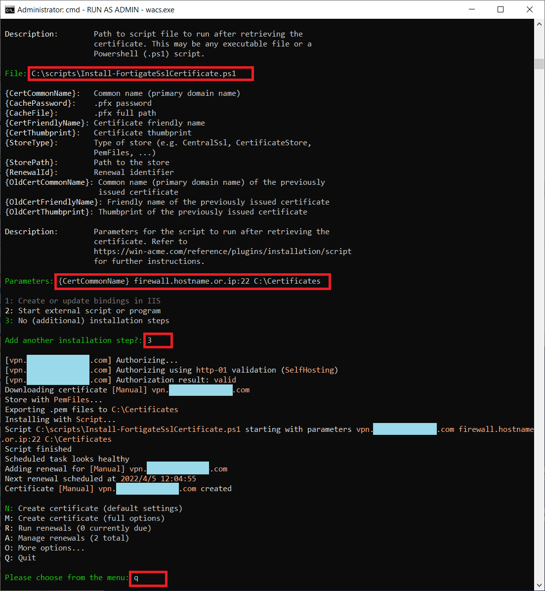
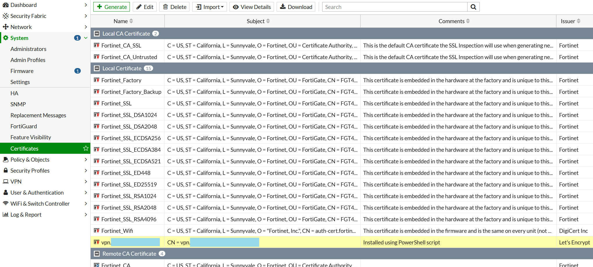

# FortiGate and Let’s Encrypt

This guide describes how to set up automatic renewal of Let’s Encrypt SSL certificates on FortiNet FortiGate firewall, from a Windows machine using win-acme and a PowerShell script.


## Prerequisites

In this example:
- DNS record for `vpn.contoso.com` points external IP of FortiGate
- VIP and firewall rule is created in FortiGate, that NAT TCP/80 to a Windows server
- Every command shown in this guide is run on this Windows server
- Everything is run as the user `serviceaccount`
- `serviceaccount` is a member of local administrators on the Windows server
- IIS is installed on Windows server (this is not a requirement)
- Windows server can SSH to FortiGate
- `win-acme` is located in `C:\bin\win-acme`
- PowerShell script(s) is located in `C:\scripts`

When accessing http://vpn.contoso.com from outside, the IIS splash screen is shown. This is not a requirement but makes it easier to test if firewall rule is working.


## PowerShell

Run these PowerShell commands. Replace `firewall.hostname.or.ip` with correct IP address or hostname of the FortiGate.

```powershell
# Install required modules
Install-Module -Name Posh-SSH,PSVault -Scope CurrentUser

# Download script
Invoke-WebRequest -Uri https://raw.githubusercontent.com/thordreier/FortiGatePowerShellScripts/main/Install-FortigateSslCertificate/Install-FortigateSslCertificate.ps1 -OutFile C:\scripts\Install-FortigateSslCertificate.ps1

# Create directory for certificates.
New-Item -ItemType Directory -Path C:\Certificates

# Set Windows Vault password for FortiGate (admin/...)
Set-VaultCredential -Name firewall.hostname.or.ip

# Window Vault can be accessed in Control Panel with
control /name Microsoft.CredentialManager

# Test that FortiGate can be accessed through SSH with the credentials stored in Windows Vault
$credential = Get-VaultCredential -Name firewall.hostname.or.ip
$session = New-SSHSession -ComputerName firewall.hostname.or.ip -Credential $credential -Port 22
Invoke-SSHCommand -Command 'get system status' -SSHSession $session | select -ExpandProperty Output
Remove-SSHSession -SSHSession $session

# If there’s issues with the Posh-SSH host keys, then look in this directory
start $HOME\.poshssh
```


## win-acme

`wacs.exe` should be "Run as Administrator".
An elevated command prompt can be started from PowerShell with

```powershell
start -Verb RunAs cmd '/k cd C:\bin\win-acme'
```


### Scheduled task

Set up scheduled task for certificate renewals. This task must run as `serviceaccount`.

Either run this, and fix scheduled task manually to run as `serviceaccount` instead of `SYSTEM`

```
wacs --setuptaskscheduler
taskschd.msc
```

Or run `wacs.exe` in interactive mode (inputted values are highlighted in red)


### Installation of certificate

Either run `wacs.exe` unattended with this command

```
wacs.exe --accepttos --emailaddress ***@******.com --source manual --host vpn.contoso.com --store pemfiles --pemfilespath C:\Certificates --installation script --script C:\scripts\Install-FortigateSslCertificate.ps1 --scriptparameters "{CertCommonName} firewall.hostname.or.ip:22 C:\Certificates"
```

Or run `wacs.exe` in interactive mode (inputted values are highlighted in red)








## Validate

Afterward validate on the FortiGate that the certificate is installed.


